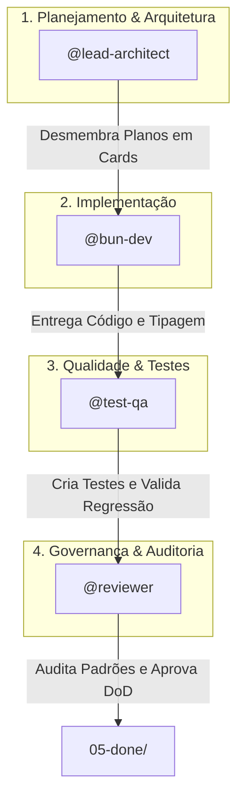

# 👥 Teamwork Preview: Matriz de Agentes e Papéis Autônomos

<div align="center">


</div>

---

## 🎯 Visão Geral do Time

O desenvolvimento do **Mercury** sob o ecossistema `.scratch/` opera com uma divisão clara de responsabilidades entre papéis de agentes especializados. Cada card do board é atribuído (`assignee`) a um papel específico, garantindo rastreabilidade, isolamento de escopo e qualidade contínua.



---

## 🎭 Definição de Papéis

### 1. `@lead-architect` (Lead Architect & Scrum Master)
- **Responsabilidade**: Manutenção da visão arquitetural, decomposição de épicos/planos técnicos (`.scratch/plans/`) em tarefas acionáveis, estimativa de story points e governança do backlog.
- **Entregáveis**: Planos em `.scratch/plans/`, criação de cards em `01-product-backlog/` e preparação de `02-sprint-backlog/`.
- **Foco Técnico**: Decisões de design, limites de módulos, conformidade com `AGENTS.md`.

### 2. `@bun-dev` (Core Runtime & CLI Engineer)
- **Responsabilidade**: Desenvolvimento de novas funcionalidades (`feat`), correções (`fix`) e refatorações (`refactor`) no app Mercury utilizando exclusivamente o runtime nativo do Bun.
- **Entregáveis**: Código TypeScript limpo, comandos Bun Shell (`$`), `Bun.spawn`, manipulação de streams e tipos em `app/src/`.
- **Foco Técnico**: Performance, segurança em I/O assíncrono, compatibilidade Windows/POSIX, zero uso de Node/npm/pnpm/yarn.

### 3. `@test-qa` (Quality Assurance & Test Engineer)
- **Responsabilidade**: Automação de testes de unidade e integração com `bun test`, cobertura de caminhos críticos e validação de regressão.
- **Entregáveis**: Arquivos de teste `*.test.ts`, suites de fixtures sintéticas, validação de timeouts e mocks.
- **Foco Técnico**: Cobertura de cenários de sucesso, erro e borda, validação estática de tipos (`bun run typecheck`).

### 4. `@reviewer` (Standards & Security Reviewer)
- **Responsabilidade**: Auditoria de conformidade com padrões de governança antes da finalização de qualquer tarefa.
- **Entregáveis**: Checklist de revisão preenchido, aprovação da Definition of Done (DoD).
- **Foco de Auditoria**:
  - Padrão [Conventional Commits](https://www.conventionalcommits.org/pt-br/v1.0.0/) e [iuricode](https://github.com/iuricode/padroes-de-commits).
  - Nomenclatura [Conventional Branch](https://conventionalbranch.org/pt-br/).
  - Impacto [SemVer 2.0.0](https://semver.org/lang/pt-BR/).
  - **Zero PII**: Garantir ausência absoluta de dados pessoais reais no código, commits e fixtures (regra fundamental de `AGENTS.md`).

---

## 📊 Matriz RACI

| Atividade | `@lead-architect` | `@bun-dev` | `@test-qa` | `@reviewer` |
| :--- | :---: | :---: | :---: | :---: |
| Criação de Planos Técnicos (`.scratch/plans/`) | **A / R** | C | C | I |
| Criação e Refinamento de Cards | **A / R** | C | C | I |
| Implementação de Código Core (`app/src/`) | I | **A / R** | C | C |
| Criação de Testes Unitários (`*.test.ts`) | I | C | **A / R** | C |
| Checagem Estática de Tipos (`typecheck`) | I | R | R | **A** |
| Auditoria de Commits, Branches e PII | I | I | I | **A / R** |
| Movimentação para `05-done/` | I | I | I | **A / R** |

> **Legenda**:
> - **R (Responsible)**: Quem executa a atividade.
> - **A (Accountable)**: Quem responde pela aprovação final da atividade.
> - **C (Consulted)**: Quem é consultado e colabora com inputs.
> - **I (Informed)**: Quem é informado sobre o progresso.

---

## 🔄 Fluxo de Transição entre Colunas

```
[01-product-backlog/] 
       │ 
       ▼ (Planejamento da Sprint por @lead-architect)
[02-sprint-backlog/] 
       │ 
       ▼ (Assumido por @bun-dev: git checkout -b feat/...)
[03-in-progress/] 
       │ 
       ▼ (Implementação concluída: typecheck ok)
[04-in-review/] 
       │ 
       ▼ (Testes por @test-qa + Auditoria por @reviewer)
[05-done/] (Merge, DoD validada, histórico limpo)
```
