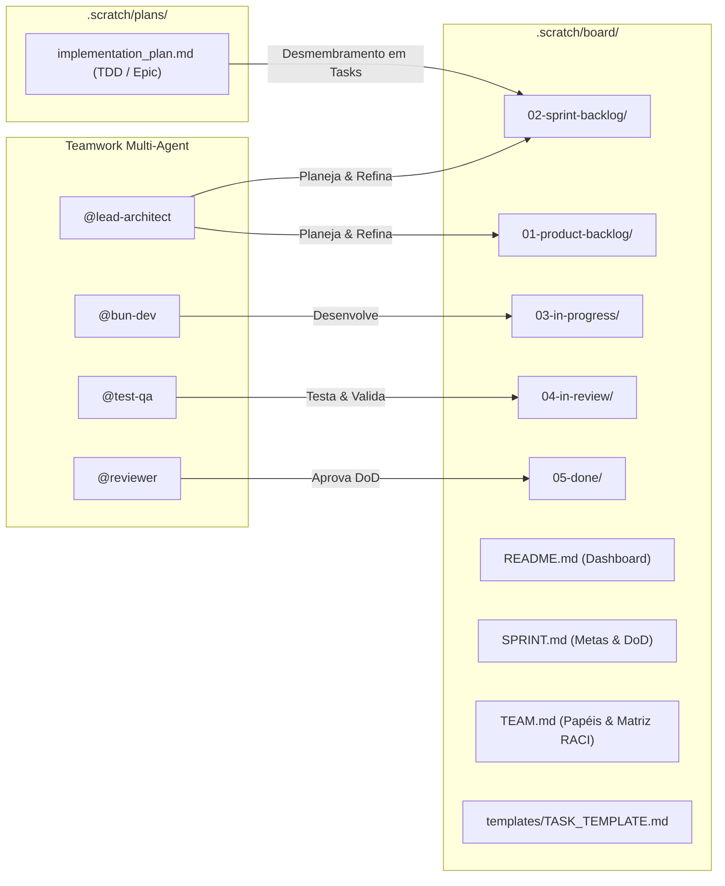

# Plano de Implementação: Sistema de Quadro Kanban/Scrum e Teamwork Preview

Estruturação do sistema de gerenciamento de tarefas ágil (Kanban/Scrum) no diretório [`.scratch/board/`](file:///d:/mercury/.scratch/board), estabelecendo conexão direta com os planos técnicos em [`.scratch/plans/`](file:///d:/mercury/.scratch/plans), e integrando padrões de **Conventional Commits**, **Conventional Branch**, **SemVer**, **Badges Shields.io** e colaboração multi-agente (**Teamwork Preview**).

---

## 1. Visão Geral e Arquitetura

O sistema de quadro Scrum/Kanban é estruturado de forma desacoplada, modular e baseada em arquivos Markdown com metadados estruturados (YAML Frontmatter) e representações visuais com badges Shields.io.

---

## 2. Estrutura de Arquivos e Componentes

### Diretório de Governança e Operação (`.scratch/board/`)
- `README.md`: Quadro visual completo com status de colunas e métricas da Sprint.
- `SPRINT.md`: Parâmetros da Sprint 1 ativa, metas, Definition of Ready (DoR) e Definition of Done (DoD).
- `TEAM.md`: Especificação dos papéis dos agentes (`@lead-architect`, `@bun-dev`, `@test-qa`, `@reviewer`) e matriz de transição.
- `templates/TASK_TEMPLATE.md`: Template oficial de cards com Shields.io, YAML Frontmatter, Conventional Branch/Commits e SemVer.
- Colunas:
  - `01-product-backlog/`
  - `02-sprint-backlog/`
  - `03-in-progress/`
  - `04-in-review/`
  - `05-done/`

### Desmembramento Inicial: Sprint 1 (ACP Registry)
- `MERC-001-acp-providers-registry.md`: Expansão dos 38 provedores ACP.
- `MERC-002-universal-model-discovery.md`: Descoberta universal de modelos via Bun Shell e handshake ACP.
- `MERC-003-cli-provider-flags-and-config.md`: Suporte a `--provider` e tipagem em `paths.ts` e `server/index.ts`.
- `MERC-004-acp-providers-unit-tests.md`: Testes unitários com `bun test` em `providers.test.ts`.

---

## 3. Padrões Obrigatórios

1. **Conventional Commits**: `<type>(<scope>): <descrição>`
   - Tipos: `feat`, `fix`, `docs`, `style`, `refactor`, `perf`, `test`, `build`, `ci`, `chore`, `revert`.
2. **Conventional Branch**: `<type>/<issue-id>-<slug>` (ex: `feat/MERC-001-acp-providers-registry`).
3. **SemVer 2.0.0**: Classificação de impacto (`MAJOR`, `MINOR`, `PATCH`).
4. **Proteção PII**: Nenhum dado real de recrutadores/empresas/usuários no histórico git (usar apenas dados sintéticos conforme `AGENTS.md`).
5. **Runtime**: Bun nativo (`bun`, `bunx`, `import { $ } from "bun"`).
