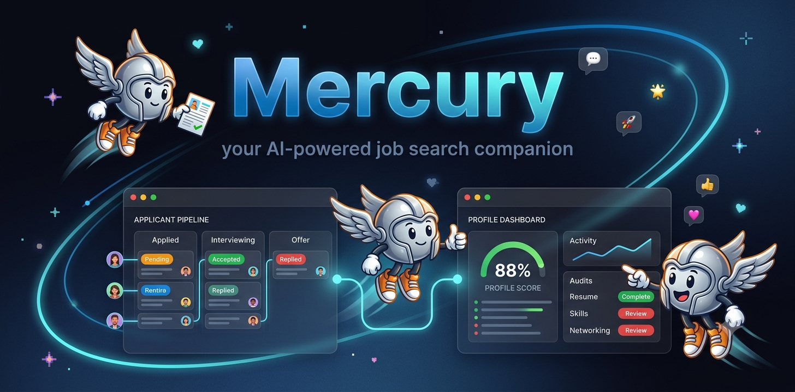
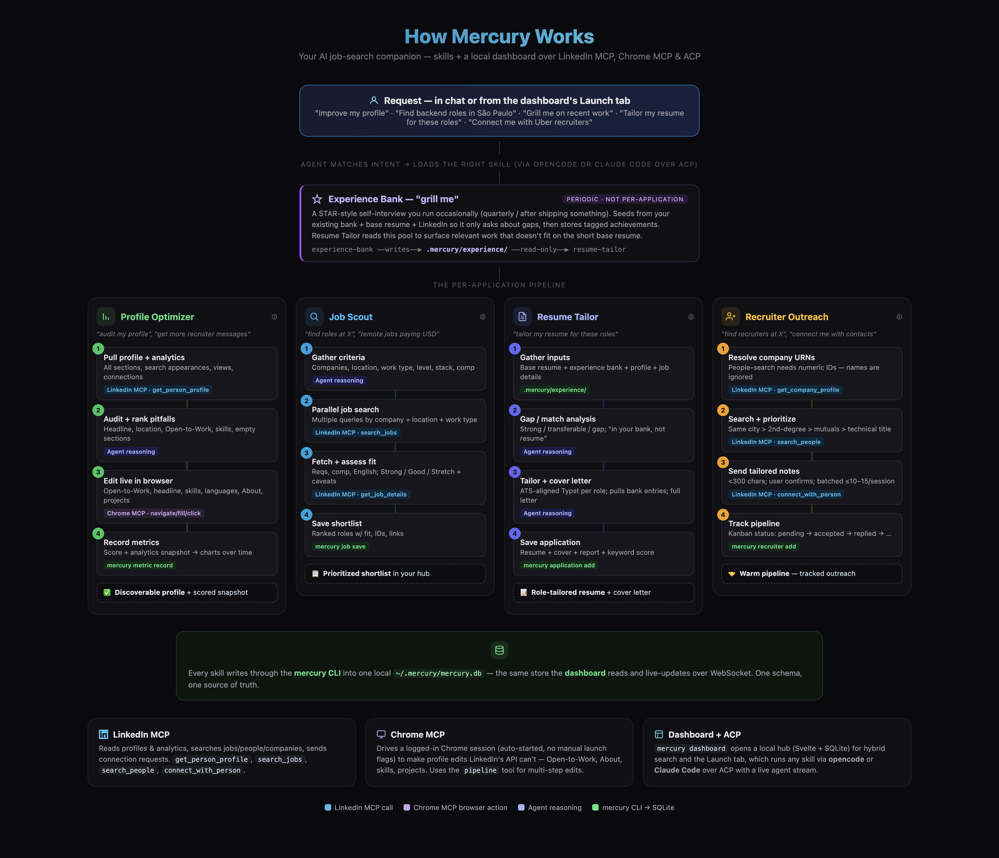

<p align="center">
  
</p>

<p align="center">
  <strong>Your AI-powered job search companion</strong><br/>
  <strong>Profile Optimizer • Job Scout • Experience Bank • Resume Tailor • Recruiter Outreach</strong><br/>
  <sub>Audit and fix your LinkedIn profile, scout roles, tailor your resume, and reach recruiters — with a local dashboard to run it all.</sub>
</p>

<p align="center">
  <picture>
    <source media="(prefers-color-scheme: dark)" srcset=".github/assets/icons/opencode-dark.svg" />
    
  </picture>&nbsp;&nbsp;&nbsp;
  
</p>

<p align="center">
  <sub>Runs your skills via <strong>opencode</strong> or <strong>Claude Code</strong> over ACP</sub>
</p>

<p align="center">
  <a href="#installation">Installation</a> · <a href="#the-dashboard">Dashboard</a> · <a href="#skills">Skills</a> · <a href=".github/assets/diagram.html">How it works</a>
</p>

---

Mercury is a collection of **AI agent skills** that automate your LinkedIn job search end-to-end, plus a local dashboard to run and track it all. It works with any AI coding assistant that supports skill files (opencode, Cursor, Claude Code, Cline, …) paired with a [LinkedIn MCP Server](https://github.com/stickerdaniel/linkedin-mcp-server) and Chrome MCP.

## Quick Start

```bash
# install (or update) — downloads a prebuilt binary and installs the skills
curl -fsSL https://raw.githubusercontent.com/Daniel-Boll/mercury/main/bootstrap.sh | bash

mercury setup        # copy skills into your detected agents (opencode, Claude Code, …)
mercury dashboard    # open the hub in your browser
```

Re-run the **same `curl` command any time to update**. See [Installation](#installation) for prebuilt targets, env overrides, and the source-build fallback.

## The Pipeline

```
                         experience-bank  (periodic, occasional)
                                │ read-only achievement pool
                                ▼
profile-optimizer → job-scout → resume-tailor → recruiter-outreach
     fix your         find the      tailor your      reach the
     profile          roles          resume          recruiters
```

## Skills

| Skill | What It Does |
|---|---|
| **profile-optimizer** | Audits your LinkedIn profile against recruiter-search signals and fixes gaps (Open to Work, headline, location, skills, languages, projects, About, experience) |
| **job-scout** | Searches LinkedIn Jobs by company/location/work-type, pulls full details, and presents a prioritized shortlist with fit assessment |
| **experience-bank** | "Grill me" — periodically interviews you about new achievements and stores them as a tagged, reusable pool in `.mercury/experience/` that resume-tailor draws from. Run occasionally, not per application |
| **resume-tailor** | Takes your base resume + experience bank + scouted roles and produces role-tailored versions with gap analysis, ATS keyword alignment, and cover letters |
| **recruiter-outreach** | Finds technical recruiters at target companies, prioritizes by proximity/mutuals, and sends tailored connection requests |

See [`.github/assets/diagram.html`](.github/assets/diagram.html) for a visual of how the skills work together.



## The Dashboard

Mercury ships a local web dashboard — a central hub for your whole job search.
Run one command and it opens in your browser:

```bash
mercury dashboard
```

What it gives you:

- **Overview** — profile score, recruiters contacted/accepted/replied, interviews, jobs
- **Profile** — recruiter-search metrics charted over time (views, search appearances, connections)
- **Search** — instant LinkedIn job/people search (hybrid: raw results via the LinkedIn MCP)
- **Launch** — run any Mercury skill through your agent (**opencode** or **Claude Code**) over [ACP](https://agentclientprotocol.com), with a live agent activity stream
- **Recruiters** — kanban pipeline (pending → accepted → replied → interviewing → closed)
- **Jobs / Applications / Interviews / Activity** — everything tracked

The dashboard is a single Bun-compiled binary with the UI embedded. It binds to
`127.0.0.1` on a random port with a URL token, and stores everything in a local
SQLite database at `~/.mercury/mercury.db`.

The `mercury` CLI is both the dashboard launcher **and** the write API the skills
call (`mercury recruiter add`, `mercury job save`, …) — one schema, one source of truth.

## The `.mercury/` Directory

Mercury stores all job search artifacts in a `.mercury/` folder in your workspace:

```
.mercury/
├── base/
│   └── resume.typ              # Your canonical base resume
├── experience/
│   ├── {slug}.md               # One tagged achievement per entry (experience-bank)
│   └── index.md                # Rollup for quick scanning
├── tailored/
│   ├── airbnb-4393940374.typ   # Tailored per role (company-jobId)
│   ├── doordash-3969556398.typ
│   └── uber-4380982336.typ
├── cover-letters/
│   ├── airbnb-4393940374.md    # Full cover letter per role
│   └── ...
├── reports/
│   ├── airbnb-4393940374.md    # Gap/match analysis per role
│   └── ...
├── logs/
│   ├── 2026-06-26T14:30:00.md  # Run history, diffs, keyword scores
│   └── ...
└── config.toml                 # Preferences (base resume path, format, targets)
```

Everything is tracked — you get full traceability of every tailoring run, outreach wave, and profile change.

## Requirements

### MCP Servers

1. **[LinkedIn MCP Server](https://github.com/stickerdaniel/linkedin-mcp-server)** — Profile reading, job search, people search, connection requests
2. **Chrome MCP** — For profile edits that LinkedIn doesn't expose via API (browser automation)

> **Windows gotcha (LinkedIn MCP login):** don't run the LinkedIn MCP login/setup
> (`uvx mcp-server-linkedin@latest --login`) from an **Administrator/elevated**
> terminal. It creates `%USERPROFILE%\.linkedin-mcp\{profile,trace-runs}\` with
> admin-only ACLs; your agent then runs the MCP at normal integrity, can't write
> `trace-runs\`, and it crashes on startup (`PermissionError: [WinError 5] Access
> is denied`, shows as **failed** in `/mcp`). Run the login from a **normal**
> terminal. If you already hit it, fix the ACLs (preserves cookies/login — no
> re-login needed) from an elevated PowerShell:
>
> ```powershell
> takeown /F "$env:USERPROFILE\.linkedin-mcp" /R /D Y
> icacls  "$env:USERPROFILE\.linkedin-mcp" /reset /T /C /Q
> ```
>
> _Thanks to [@juanASP](https://github.com/juanASP) for confirming this on Win11._

### Browser Setup

Chrome MCP auto-starts a Chrome session on its first tool call — no manual
`--remote-debugging-port` launch flags required. Just make sure you're logged
into LinkedIn in that session.

> **Tip:** For multi-step edit flows the skills use Chrome MCP's `pipeline`
> tool (navigate → snapshot → click/fill in one call), which is faster and more
> reliable than individual round-trips.

## Installation

```bash
curl -fsSL https://raw.githubusercontent.com/Daniel-Boll/mercury/main/bootstrap.sh | bash
```

The one-liner installs (or updates) Mercury and copies the skills:

- detects your OS/arch and **downloads a prebuilt binary** from the latest [GitHub Release](https://github.com/Daniel-Boll/mercury/releases) (SHA256-verified) → `~/.local/bin/mercury` — no build, just `curl`;
- copies the skills into detected agent dirs (`~/.config/opencode/skills`, `~/.claude/skills`);
- **falls back to a source build** with [Bun](https://bun.sh) if no prebuilt binary matches your platform.

Prebuilt targets: `linux-x64`, `linux-arm64`, `darwin-x64`, `darwin-arm64`, `windows-x64`.

> **Windows:** run the one-liner from **Git Bash** (or WSL) — it installs
> `mercury.exe`. There's no `windows-arm64` prebuilt (Bun doesn't compile it);
> on Windows-arm64 the installer falls back to a source build with Bun.

> Make sure `~/.local/bin` is on your `PATH` (the installer prints a hint if not).
> Re-run the same command any time to update — `mercury` also prints a one-line
> notice when a newer release is available.

**Env overrides:** `MERCURY_VERSION` (pin a tag, e.g. `v0.2.0`), `MERCURY_FROM_SOURCE=1`,
`MERCURY_BIN_DIR`, `MERCURY_SKILLS_DIR`, `MERCURY_NO_SKILLS=1`, `MERCURY_NO_UPDATE_CHECK=1`.

### Installing the skills (`mercury setup`)

The bootstrap copies skills for you. To (re)install them into your agents at any
time — e.g. after adding a new agent:

```bash
mercury setup                 # every detected agent (opencode, Claude Code, Cursor, Codex, …)
mercury setup --agent opencode   # just one
mercury setup --all              # include agents that aren't detected yet
mercury setup --skills-dir <path># an explicit directory
```

For the **Launch** tab you also need an ACP-capable agent on PATH: `opencode`
(native `opencode acp`) or `claude` (Claude Code, via `@zed-industries/claude-code-acp`).

> Contributing or running from a clone? See [AGENTS.md](AGENTS.md) for the build
> and dev workflow.

## Usage

The agent loads these skills automatically when your request matches their description. Examples:

- _"Audit my LinkedIn profile and help me get more recruiter messages"_ → loads `profile-optimizer`
- _"Find backend engineer roles at DoorDash and Airbnb in São Paulo"_ → loads `job-scout`
- _"Tailor my resume for these 3 roles I scouted"_ → loads `resume-tailor`
- _"Find recruiters at Uber who hire in Brazil and connect with them"_ → loads `recruiter-outreach`

## What Mercury Can Do

### Profile Optimizer

- Pull full profile analytics (search appearances, views, impressions)
- Identify specific pitfalls ranked by recruiter-search impact
- Edit via browser automation: Open to Work (recruiter-only), headline, location, top skills, languages, projects, About section, experience descriptions
- Remove internal-mobility cards that signal "not looking"

### Job Scout

- Search by company + location + work type + seniority
- Get full job descriptions with requirements and compensation
- Assess fit (Strong / Good / Stretch) based on your profile
- Flag diversity-scoped roles, staffing aggregators, and external ATS friction

### Experience Bank

- "Grill me" — STAR-style interview that probes for impact, metrics, scope, and tech
- Seeds from your existing bank + base resume + LinkedIn profile, so it only asks about gaps and new material
- Stores tagged entries in `.mercury/experience/` (skills, tech, domain, role-type, metrics)
- Incremental + idempotent — run periodically (quarterly/after shipping), never re-grills what it already has
- Truthful by construction — structures real stories, never invents

### Resume Tailor

- Parse your base resume (Typst/MD/PDF/txt) + experience bank + LinkedIn profile data
- Pulls role-relevant experience-bank entries even when they aren't on the short base resume
- Batch-tailor to N scouted roles in one pass
- Produce ATS-keyword-aligned Typst output per role
- Generate full cover letters per role
- Gap/match analysis showing what's strong, what's a stretch, what's in your bank, what's missing
- All outputs stored in `.mercury/` with full run logs

### Recruiter Outreach

- Look up company URN IDs (required for LinkedIn's people search filter)
- Find technical recruiters/sourcers at target companies in your region
- Prioritize by: same city > 2nd-degree > mutual connections > relevant title
- Send connection requests with short, specific notes (<300 chars)
- Provide follow-up templates for post-acceptance

## Known Quirks & Limitations

- **Cannot auto-apply** to external ATS (Workday, Greenhouse) — these need personal data and auth answers
- **LinkedIn rate limits** — don't send >10-15 connection requests per session
- **Top Skills** are managed inside the About editor (`/add-edit/SUMMARY/`), not the Skills detail page
- **Company URN IDs** are required for people search filters — plain names are silently ignored
- **Typeahead fields** (language, skills) require ArrowDown + Enter after typing
- **"Notify network" toggle** — always verify it's OFF before saving experience edits

## Keywords

LinkedIn automation, job search AI, recruiter outreach, resume tailoring, profile optimization, experience bank, achievement tracking, ATS optimization, LinkedIn MCP, AI job hunting, career toolkit, LinkedIn bot, job scout, cover letter generator, LinkedIn skills for AI agents

## License

The Unlicense — public domain. Do whatever you want with it.
