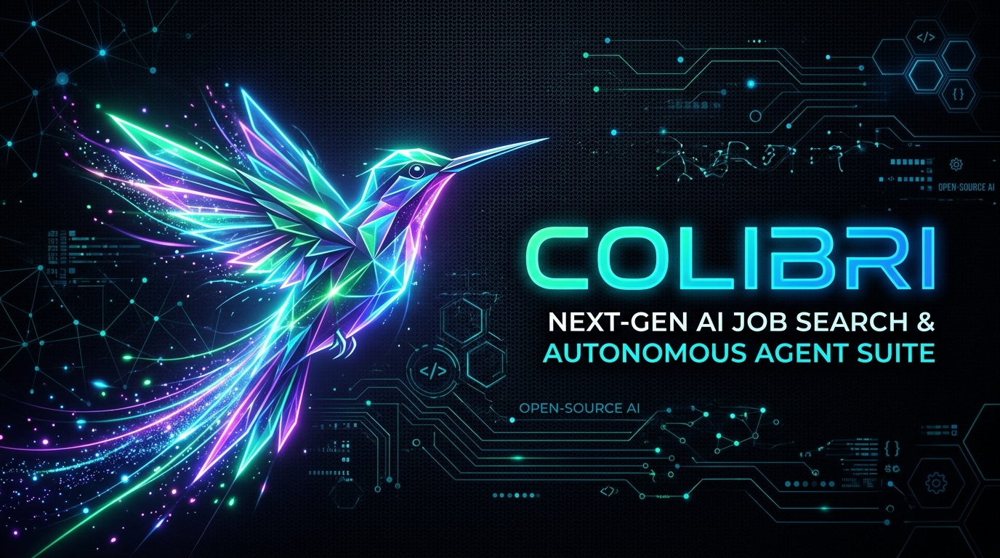
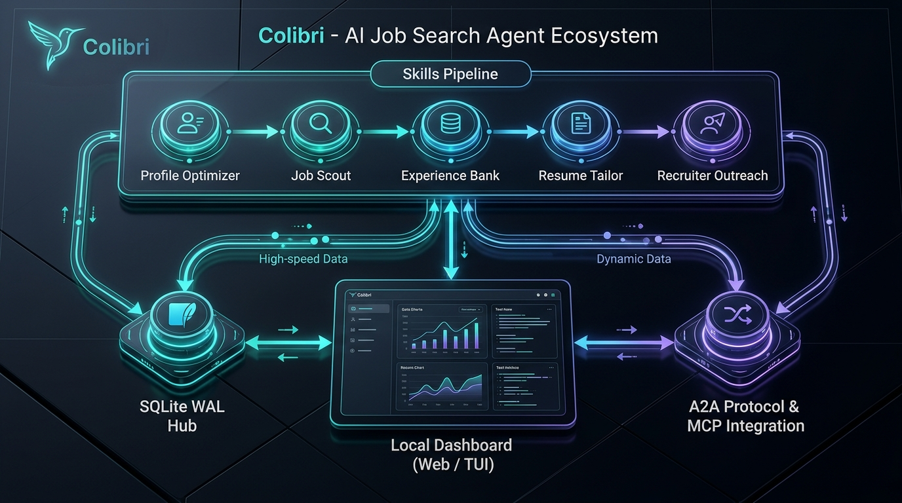
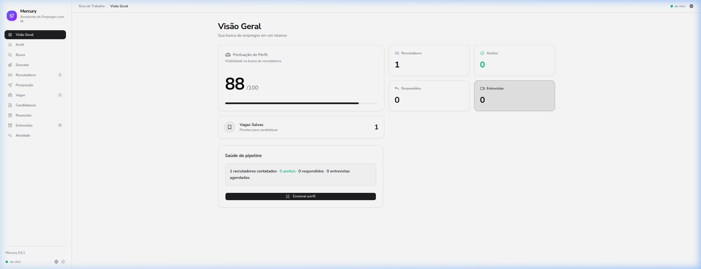
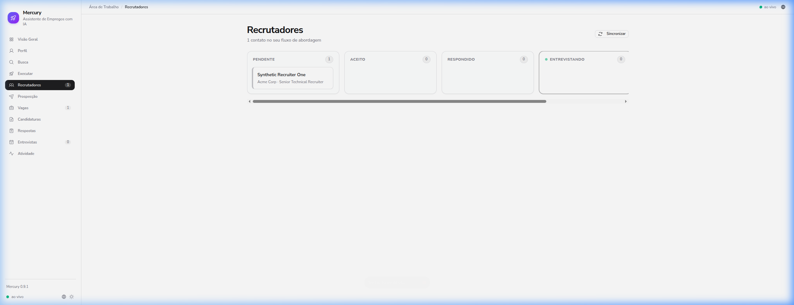
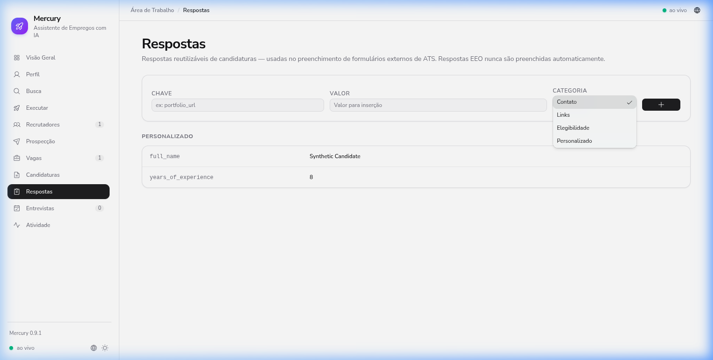
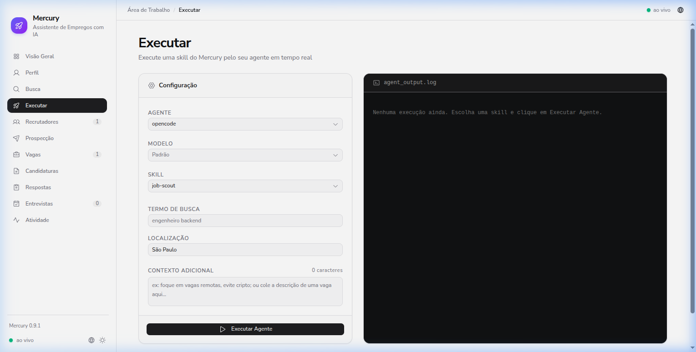

<p align="center">
  
</p>

<p align="center">
  <strong>Colibri — Autonomous AI Job Search Companion & Agent Suite</strong><br/>
  <strong>Profile Optimizer • Job Scout • Experience Bank • Resume Tailor • Recruiter Outreach • ATS Portal Filler</strong><br/>
  <sub>Audit and enhance your LinkedIn visibility, scout matching roles, tailor your resume, and connect with recruiters — with a local Web dashboard and interactive TUI.</sub>
</p>

<p align="center">
  <picture>
    <source media="(prefers-color-scheme: dark)" srcset=".github/assets/icons/opencode-dark.svg" />
    
  </picture>&nbsp;&nbsp;&nbsp;
  
</p>

<p align="center">
  <sub>Orchestrates autonomous skills via <strong>opencode</strong>, <strong>Claude Code</strong>, or any ACP agent, with native <strong>A2A Protocol</strong> support</sub>
</p>

<p align="center">
  <a href="#quick-start">Quick Start</a> · <a href="#hard-refactor-notice">About the Fork</a> · <a href="#architecture--monorepo">Architecture</a> · <a href="#the-dashboard">Dashboard</a> · <a href="#skills">Skills</a>
</p>

---

> [!IMPORTANT]
> ### 🚀 Hard Refactor Notice: Welcome to Colibri
> **Colibri** is a **hard refactor** built upon the foundations of [Mercury](https://github.com/joaovjo/mercury). While preserving Mercury's original mission of automating end-to-end job searches, **Colibri departs decisively from the original codebase**:
> - **Monolithic Backend Eliminated**: The legacy `packages/backend` has been completely dissolved and restructured into a clean, modular multi-package Bun monorepo.
> - **Modular Architecture**: Functionality is decoupled into independent packages: `@mercury/core`, `@mercury/db`, `@mercury/outreach`, `@mercury/recruiter`, `@mercury/ats`, `@mercury/acp`, `@mercury/mcp`, `@mercury/a2a`, and `@mercury/server`.
> - **A2A Protocol (Agent-to-Agent)**: Implements the open [A2A Protocol](https://a2a-protocol.org/) specification (`/.well-known/agent.json` and JSON-RPC 2.0 task handling) for direct autonomous agent interoperability.
> - **Terminal UI (TUI)**: Includes a first-class, standalone terminal app built with **OpenTUI** (`mercury tui`), in addition to the embedded React 19 web dashboard.
> - **Modern Bun & TypeScript 7**: Native hoisted linker (`[install] linker = "hoisted"`), dependency catalogs, and strict TypeScript 7 type safety.

---

## The Colibri Ecosystem

<p align="center">
  
</p>

Colibri combines **specialized AI agent skills**, a **local SQLite WAL database**, **multi-agent protocol adapters (ACP + A2A + MCP)**, and **local user interfaces (Web & TUI)** into an integrated command center for your career.

```
                         experience-bank  (periodic, STAR interviews)
                                │ read-only achievement pool
                                ▼
profile-optimizer → job-scout → resume-tailor → recruiter-outreach
     audit &          find matching    tailor resume     connect with
     optimize         opportunities    & cover letter     recruiters
                                │
                                └──→ portal-filler
                                     map & autofill
                                     ATS application
```

---

## Architecture & Monorepo

Colibri is engineered as a clean Bun workspace monorepo:

```
.
├── apps/
│   ├── cli/             # @mercury/cli: binary entrypoint, subcommands, setup, TUI runner
│   ├── web/             # @mercury/web: React 19 dashboard (Tailwind v4, shadcn, Phosphor)
│   └── tui/             # @mercury/tui: interactive OpenTUI terminal interface
│
├── packages/
│   ├── a2a/             # @mercury/a2a: A2A Protocol (Agent Card, JSON-RPC 2.0 task server)
│   ├── acp/             # @mercury/acp: Agent Client Protocol (provider registry, sessions)
│   ├── ats/             # @mercury/ats: ATS form-label matcher & adapter registries
│   ├── core/            # @mercury/core: central paths, config, versioning, update check
│   ├── db/              # @mercury/db: SQLite connection (bun:sqlite, WAL), schema, notify
│   ├── mcp/             # @mercury/mcp: LinkedIn MCP client, hybrid search, browser cleanup
│   ├── outreach/        # @mercury/outreach: relationship-memory engine, store, budget
│   ├── recruiter/       # @mercury/recruiter: recruiter sync (accepted-invite detection)
│   └── server/          # @mercury/server: Bun.serve dashboard server, WebSocket, REST/A2A
│
├── scripts/
│   ├── embed-assets.ts  # inlines apps/web/dist into packages/server/src/assets.ts
│   ├── build-targets.ts # cross-compiles all release targets into dist/
│   └── extract-changelog.sh # extracts version notes from CHANGELOG.md for CI
├── skills/              # plain-markdown agent skills (loaded by any skill-aware assistant)
├── bunfig.toml          # [install] linker = "hoisted"
└── package.json         # workspace roots + dependency catalogs (typescript ^7.0.0)
```

- **Single source of truth**: All state mutations route through the CLI subcommands (`recruiter`, `job`, `metric`, `score`, `interview`, `application`, `answer`, `activity`). Skills never manipulate SQLite directly.
- **Embedded Single Binary**: The React web dashboard is built and inlined into `packages/server/src/assets.ts` at build time, yielding a self-contained release binary in `dist/mercury`.

---

## Quick Start

### Development & Local Build

Colibri requires [Bun](https://bun.sh) (>= 1.3.0).

```bash
# 1. Clone and install dependencies with hoisted linker
git clone https://github.com/joaovjo/mercury.git colibri
cd colibri
bun install --linker hoisted

# 2. Run the CLI in dev mode
bun run dev --help

# 3. Launch local interfaces
bun run dev:web     # React 19 Dashboard (Hot Reload)
bun run dev:tui     # Interactive OpenTUI Terminal App

# 4. Run verification suites
bun run typecheck   # Full TypeScript 7 typecheck across all workspaces
bun test            # Complete unit and integration test suite

# 5. Build self-contained release binary
bun run build       # build:web -> embed assets -> compile dist/mercury
./dist/mercury --help
```

### Installation (Prebuilt Binary)

```bash
# Bash / zsh:
curl -fsSL https://raw.githubusercontent.com/joaovjo/mercury/main/scripts/bootstrap.ts | bun run -

# Install local build into path:
bun run install:bin
mercury setup --all
```

---

## The Dashboard

Run one command to open the local hub in your browser:

```bash
mercury dashboard
```

Or launch the interactive terminal interface:

```bash
mercury tui
```

The web dashboard is served directly by `packages/server` with the UI embedded. It binds to `127.0.0.1` on an auto-assigned port with a secure random token, updates live over WebSockets, and stores state in `~/.mercury/mercury.db`.

| Overview | Recruiters Pipeline |
| :---: | :---: |
|  |  |
| **Overview** — pipeline score, active contacts, jobs, and metrics | **Recruiters** — kanban pipeline with one-click acceptance sync |
| **Candidate Answers Store** | **Agent Launch & Streaming** |
|  |  |
| **Answers** — reusable ATS answers grouped by category | **Launch** — ACP agent runner with live streaming output |

---

## Skills Suite

Colibri bundles 7 AI agent skills ready to load into opencode, Claude Code, Cursor, or Codex:

| Skill | Description |
|---|---|
| **profile-optimizer** | Audits your LinkedIn profile against recruiter search signals and guides updates (Open to Work, headline, skills, about, experience). |
| **job-scout** | Searches LinkedIn Jobs by company, location, work-type, and comp; pulls full descriptions and produces a prioritized shortlist with fit assessment. |
| **experience-bank** | *"Grill me"* — Conducts structured STAR-style interviews to capture impact, metrics, and tech stack into tagged achievement files in `.mercury/experience/`. |
| **resume-tailor** | Merges your canonical base resume + experience bank + scouted roles to produce role-tailored versions with ATS keyword alignment and cover letters. |
| **recruiter-outreach** | Finds relevant technical recruiters/sourcers at target companies, prioritizes by network proximity, and drafts tailored connection notes. |
| **outreach-tracker** | Drives the outreach cadence queue (withdraw stale invites, prompt follow-ups, record replies, respect cooldown periods). |
| **portal-filler** | Detects ATS platforms (Greenhouse, Lever, Ashby, Generic), maps fields to your stored answers, uploads your tailored resume, and pauses for human review before submission. |

### Installing Skills into Your Agent

```bash
mercury setup                    # all detected agents
mercury setup --agent opencode   # specific agent
mercury setup --all              # include non-detected agents
```

---

## What Colibri Does

### 🎯 Profile Optimization
- Pulls search appearance trends, profile views, and connection counts.
- Flags recruiter-search anti-patterns (e.g. internal mobility badges signaling "not looking").
- Streamlines profile updates via Chrome MCP automation.

### 🔍 Precision Job Scouting
- Queries LinkedIn jobs with structured filters (seniority, remote/hybrid, keywords).
- Evaluates fit (Strong / Good / Stretch) against your experience bank.
- Identifies ATS application friction points and salary ranges upfront.

### 🧠 Experience Bank ("Grill Me")
- Incremental, non-repetitive achievement extraction.
- Stores evidence-backed achievements tagged by role, tech, and quantifiable metrics.
- Enforces truth in resume tailoring — never invents claims.

### 📄 Role-Tailored Resumes
- Compiles ATS-optimized Typst and Markdown resumes tailored to specific opportunities.
- Generates aligned cover letters with custom gap analysis.
- Stores generated artifacts in `~/.mercury/tailored/` and `~/.mercury/cover-letters/`.

### 🤝 Recruiter Relationship Engine
- Identifies technical recruiters by company URN, mutual connections, and geographic fit.
- Enforces InMail budgeting, reserve floors, and withdrawal of stale invitations.
- Automatically syncs 1st-degree connection acceptances via `mercury recruiter sync`.

### 📝 Smart ATS Form Auto-Fill (`portal-filler`)
- Detects the target ATS portal from the application URL:
  ```bash
  mercury detect-portal --url "https://boards.greenhouse.io/acme/jobs/1234"
  ```
- Matches form labels against stored answers:
  ```bash
  mercury match --labels '["Email *", "First Name", "LinkedIn Profile"]'
  ```
- Manages reusable answers via CLI or Dashboard:
  ```bash
  mercury answer set --key "github_url" --value "https://github.com/..." --category "links"
  mercury answer list
  ```
- **Fill-then-pause safety**: Never auto-submits. You retain full control to review the populated fields before submitting.

---

## The `~/.mercury/` State Directory

All personal career data resides in your user home directory (override via `MERCURY_HOME`):

```
~/.mercury/
├── mercury.db            # SQLite database (WAL mode): recruiters, jobs, metrics, interviews, ...
├── config.json           # User configuration (provider, outreach parameters, InMail limits)
├── dashboard.lock        # {port, token, pid} of the running dashboard server
├── update-check.json     # Cached update status
├── base/                 # Canonical base resume (resume.typ)
├── experience/           # Tagged achievement files from experience-bank
├── tailored/             # Tailored resumes per role (company-jobId.typ)
├── cover-letters/        # Generated cover letters
├── reports/              # Match/gap analysis reports
└── logs/                 # Run history and audit trails
```

> **Privacy Guarantee**: All personal outreach data, candidate answers, and recruiter interactions remain strictly local inside `~/.mercury/`. No telemetry, no cloud relays, no PII committed to source control.

---

## Agent Protocols: A2A, ACP & MCP

Colibri bridges three modern agent standards:
1. **[A2A Protocol](https://a2a-protocol.org/)**: Exposes an Agent Card at `/.well-known/agent.json` and JSON-RPC 2.0 task endpoints for autonomous agent-to-agent task delegation.
2. **[Agent Client Protocol (ACP)](https://agentclientprotocol.com/)**: Enables the dashboard's Launch tab to drive local coding assistants (such as `opencode` or `claude-code`) directly with live event streaming.
3. **[Model Context Protocol (MCP)](https://modelcontextprotocol.io/)**: Connects to the [LinkedIn MCP Server](https://github.com/joaovjo/linkedin-mcp-server-ts) and Chrome MCP for seamless browser interactions.

---

## Contributing & Development

We welcome contributions! Please review [AGENTS.md](AGENTS.md) for architectural guidelines, coding conventions, and test rules.

```bash
bun run typecheck   # must pass with 0 errors
bun test            # all test suites must pass
bun run build       # validates packaging and compiled binary output
```

---

## License

The Unlicense — public domain. Free for personal, academic, and commercial use.
